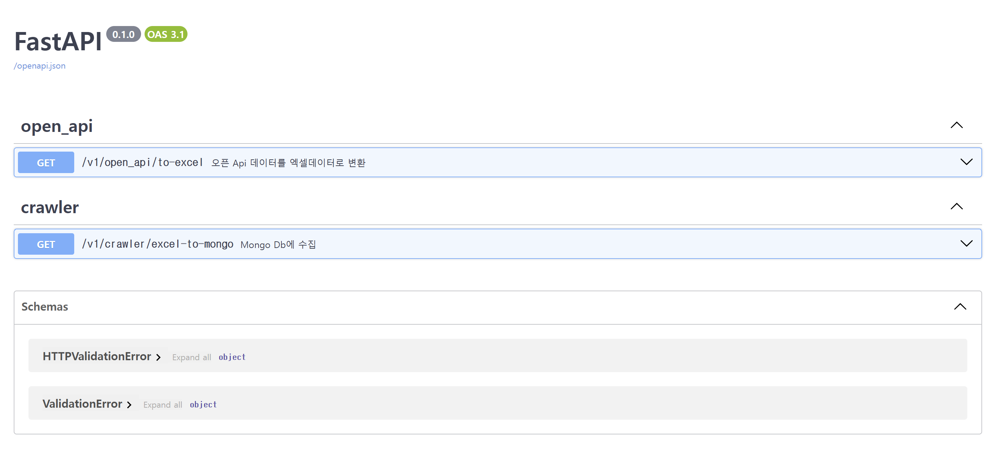

# python-crawler
파이썬 기반 수집기입니다.

파이썬 기반 스프레드 시트 데이터 수집기. 스프레드 시트 데이터를 읽어서 Mongo DB에 적재하는 프로세스. 이 때 적재하는 필드는 사용자 정의한 필드만을 사용. 사용자 정의 필드 관리는 PostgreDB로 관리. 파이썬 가상환경에서 uvicorn으로 프로젝트 실행.

- 개발자: 최다연, 유진희
- 개발 언어: Python 3.10.11
- 사용 DB: MongoDB, PostgreDB
- 개발 환경: Visual Studio Code

